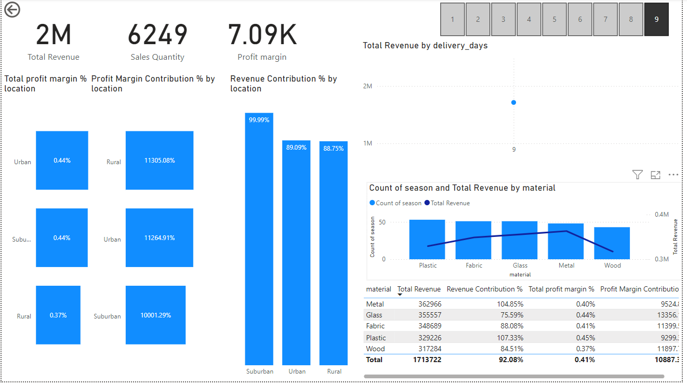

# 🪑 Furniture Sales Analysis Dashboard

This project contains a **Power BI dashboard** that visualizes and analyzes sales performance, profit margins, and material contributions across different locations for a furniture business.

---

## 📊 Overview

The dashboard provides a comprehensive view of:

- 📈 **Total Revenue**: 2M  
- 📦 **Sales Quantity**: 6,249  
- 💰 **Profit Margin**: 7.09K  

It breaks down the data by **location**, **material**, and **delivery days** to help derive actionable business insights.

---

## 🔍 Key Visuals & Metrics

### 🏙️ By Location
- **Total Profit Margin %**:
  - Urban: 0.44%
  - Suburban: 0.44%
  - Rural: 0.37%
  
- **Profit Margin Contribution %**:
  - Rural: 11,305.08%
  - Urban: 11,264.91%
  - Suburban: 10,001.29%

- **Revenue Contribution %**:
  - Suburban: 99.99%
  - Urban: 89.09%
  - Rural: 88.75%

---

### 🪵 By Material

| Material | Total Revenue | Revenue Contribution % | Total Profit Margin % | Profit Margin Contribution |
|----------|----------------|--------------------------|-------------------------|------------------------------|
| Metal    | 362,966        | 104.85%                  | 0.40%                  | 9,524.13                     |
| Glass    | 355,557        | 75.59%                   | 0.44%                  | 13,356.55                    |
| Fabric   | 348,689        | 88.08%                   | 0.41%                  | 11,399.89                    |
| Plastic  | 329,226        | 107.33%                  | 0.45%                  | 9,299.73                     |
| Wood     | 317,284        | 84.51%                   | 0.37%                  | 11,897.55                    |

---

## 🚚 Delivery Performance

- The dashboard highlights **Delivery Day 9** as having the **highest revenue**.
- Visuals compare **delivery days** to revenue impact.

---

## 🧠 Insights

- Suburban areas lead revenue contribution.
- High profit margin materials: **Glass** and **Plastic**.
- Delivery timing affects sales—day 9 performs best.
- Uniform profit % across locations, suggesting opportunity for regional pricing strategies.

---

## 📂 Files

- `furniture.png`: Dashboard screenshot
- `README.md`: Project documentation

---

## 🚀 How to Use

1. Clone this repository.
2. View the dashboard image or open the associated `.pbix` file (if added).
3. Use it as a reference or base for your own Power BI projects.

---

## 📧 Contact

For questions or collaboration, reach out via GitHub Issues or open a Pull Request.

---

